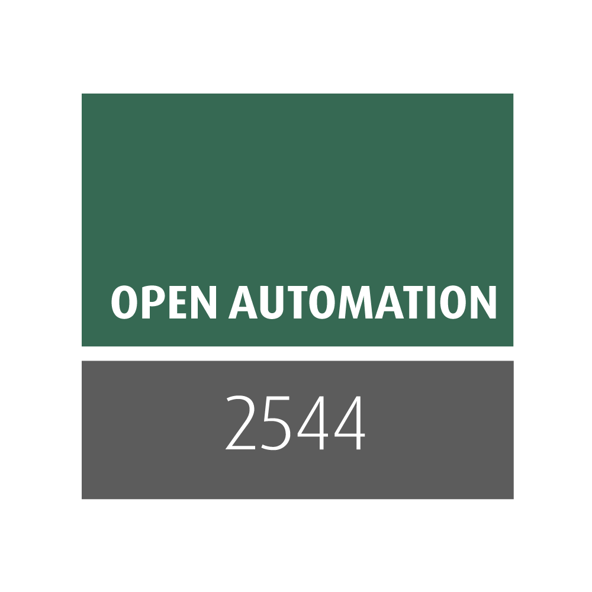
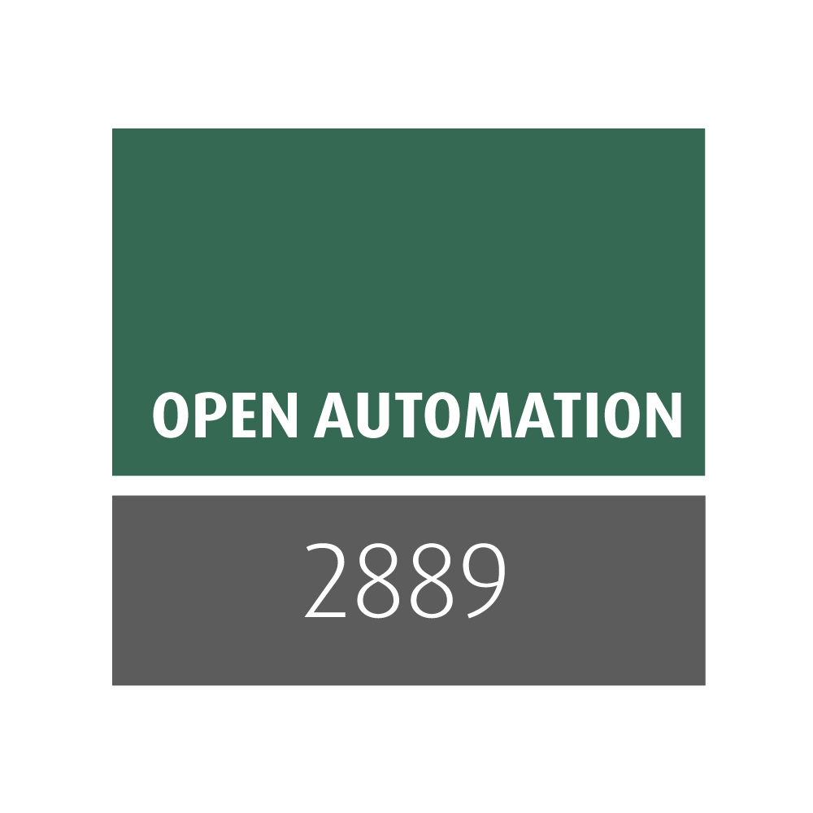
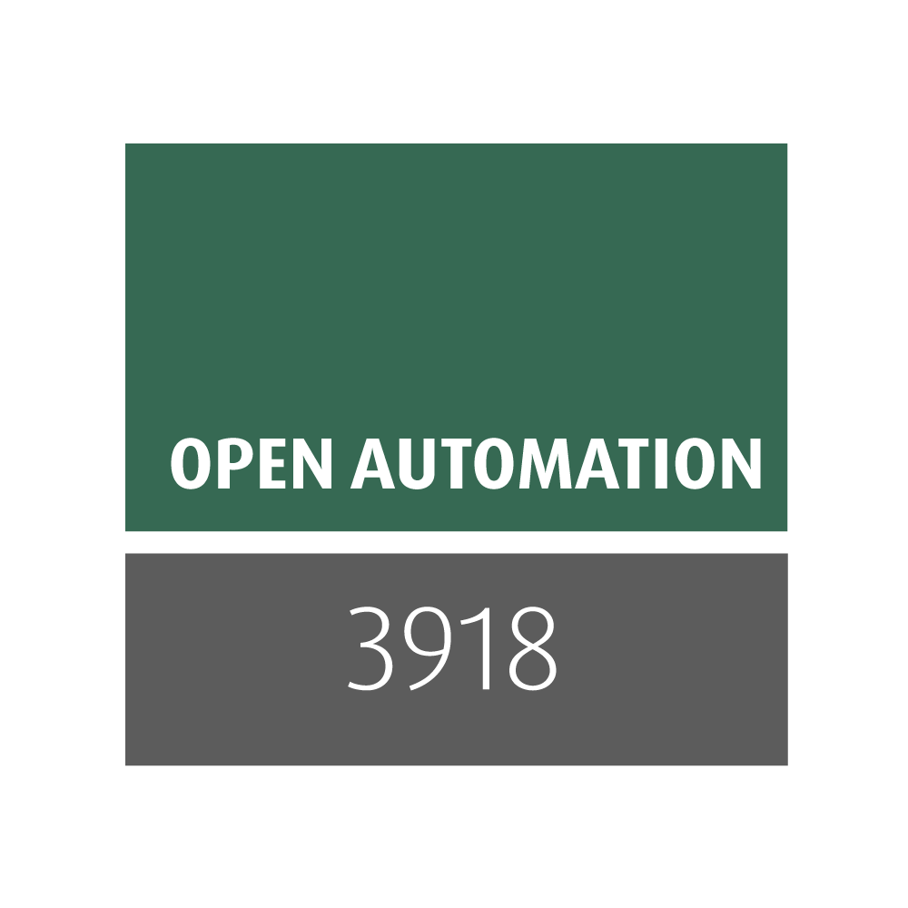

Introduction
============

Xena Python RFC Core is an open-source test suite framework for network automation and testing. It is designed to host various `Xena Python RFC Test Suites <https://github.com/xenanetworks/open-automation-test-suites>`_ as plugins, allowing users to create, manage, and run test cases for different network scenarios. The Xena Python RFC Core framework serves as the foundation for building and executing test suites in the XOA ecosystem.

Key features include:

1. Modular architecture: The test suite framework employs a modular architecture, enabling users to develop and run different test suites as plugins.

2. Test Suite execution: Supports both local and remote test suite execution. Users can execute test suites on their local machines or on remote testbeds through the XOA CLI or Web GUI.

3. Test Case management: Provides tools for managing test cases, including creating, updating, and deleting them. Users can also organize test cases using tags and execute them in parallel or sequentially.

4. Extensibility: The framework is designed to be extensible, allowing users to develop custom test suites and plugins to address specific testing requirements.

5. Logging and reporting: Offers built-in logging and reporting functionality, generating detailed test reports to help users analyze test results and identify issues.

The `official documentation <https://docs.xenanetworks.com/projects/xena-python-rfc-core>`_ provides a comprehensive guide on how to install, configure, and use Xena Python RFC Core. It covers topics such as setting up the environment, creating test suites, executing test cases, and analyzing test results. The documentation also includes a reference for Xena Python RFC Core's API and example test suites to help users get started with their test automation projects.

