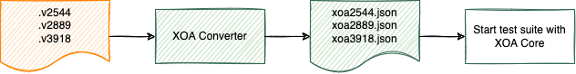

Migrate from Xena Windows Desktop Test Suites
=============================================

We have developed a test configuration converter, `XOA Converter <https://docs.xenanetworks.com/projects/tdl-xoa-converter/>`_, to help users easily migrate their existing Windows test suite configurations ( `.x2544` for :term:`Xena2544`, `.x2889` for :term:`Xena2889`, `.x3918` for :term:`Xena3918`) into XOA. The illustration below may help you understand the use flow. 

This converter is meant for those who want to integrate Xena Python RCC test suites into their own Python environment.

